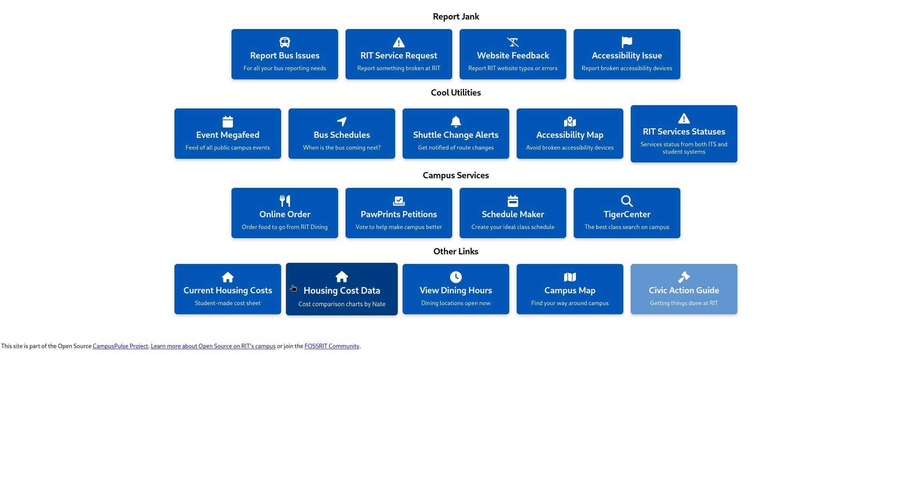
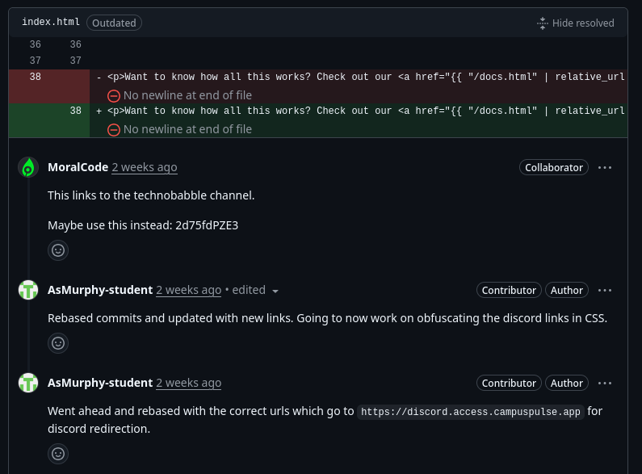
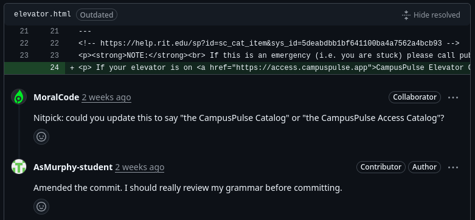

## CampusPulse Introduction

CampusPulse is student made system of tools for student on RIT campus to help with accessibility and to solve other problems that students have on a daily basis. CampusPulse includes utilities such as Bus Schedules, reporting of broken elevators, statuses of other RIT services, and other services and links to other RIT services. It is meant to be a hub for many different tools that an RIT student may need to use.

_Main page of CampusPulse_

I chose this project as I have contributed lightly to this project before, and it is a good project to contribute to even if you do not necessarily understand the whole stack of whatever section of CampusPulse you might be working on. It's a great opportunity to learn the stack being used, as most issues are non-critical and thus you can take your time learning the stack and communicating with the maintainers to get the right changes implemented for whatever pull request you are doing.

My Comm Arch Experience further reinforced that I should choose this project due to the project's good community and heavy involvement with RIT. There are many issues that can be tackled and it is overall a good project to jump into with many different avenues you can contribute.

For resources, there are some high level documentation [here](https://github.com/CampusPulse/docs/wiki) for the whole system. For documentation on specific pieces, there are READMEs available in each repository on development set up, among other things.

## The Issue and Contribution

Ok, so the issue I chose to do was adding discord links to the report page on CampusPulse. I chose this as this was an easy issue to do with not much work to do. I was also already familiar with this specific section of CampusPulse as this specific contribution was actually an addition to a [PR](https://github.com/CampusPulse/report/pull/16) I did a few months back that had not been closed yet. The main issue this actually closed with the work I did a few months ago, which was adding discord metadata to links so an embedded preview could appear in discord, is [here](https://github.com/CampusPulse/report/issues/6).

I went ahead and dug into the code, and ensured that I knew where to add the links in the pages where they were requested to be at.

I originally, accidentally, pushed links to a specific channel in the discord, and had to recommit new links to the server in general. I ran the report site in development mode, and confirmed that I made the correct changes before pushing them to my fork and requesting a code review.

_GitHub conversation on fixing to have correct discord link instead of specific channel_

_Nitpick requested change for linking to elevator catalog_

Nothing blocked me from doing this simple Pull Request.

In order for it to be merged, I went ahead and made the necessary changes upon review that needed to be changed, such as updating the links, and re-requested review upon which it was merged successfully.
